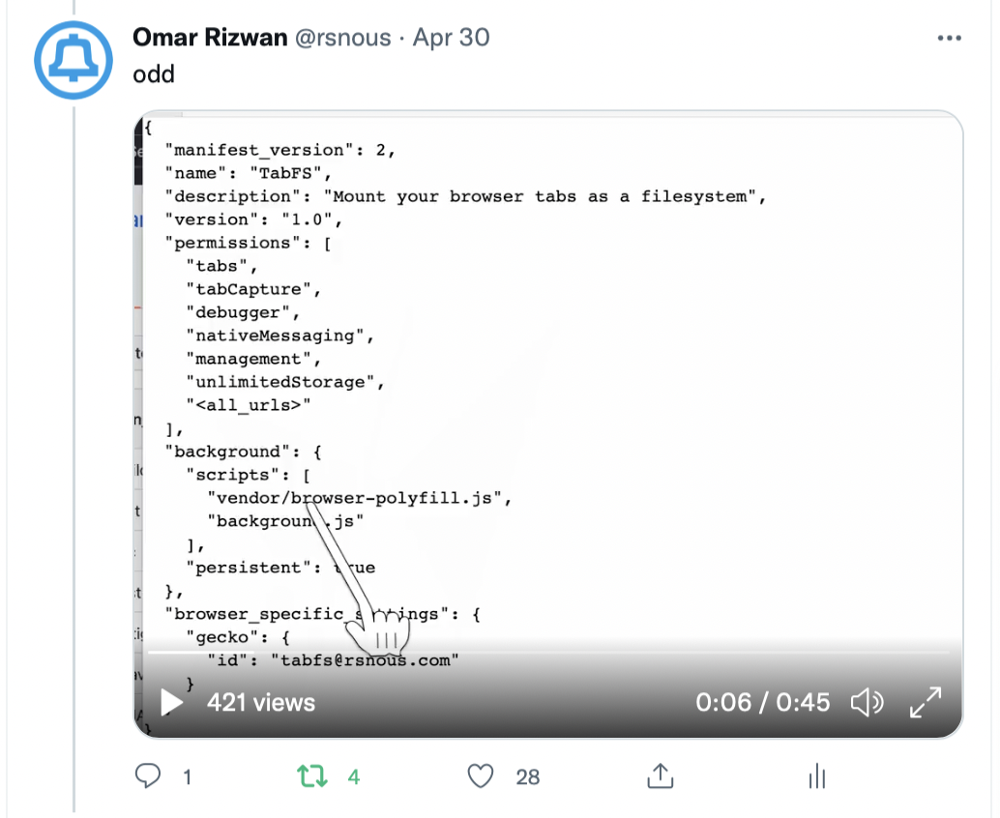
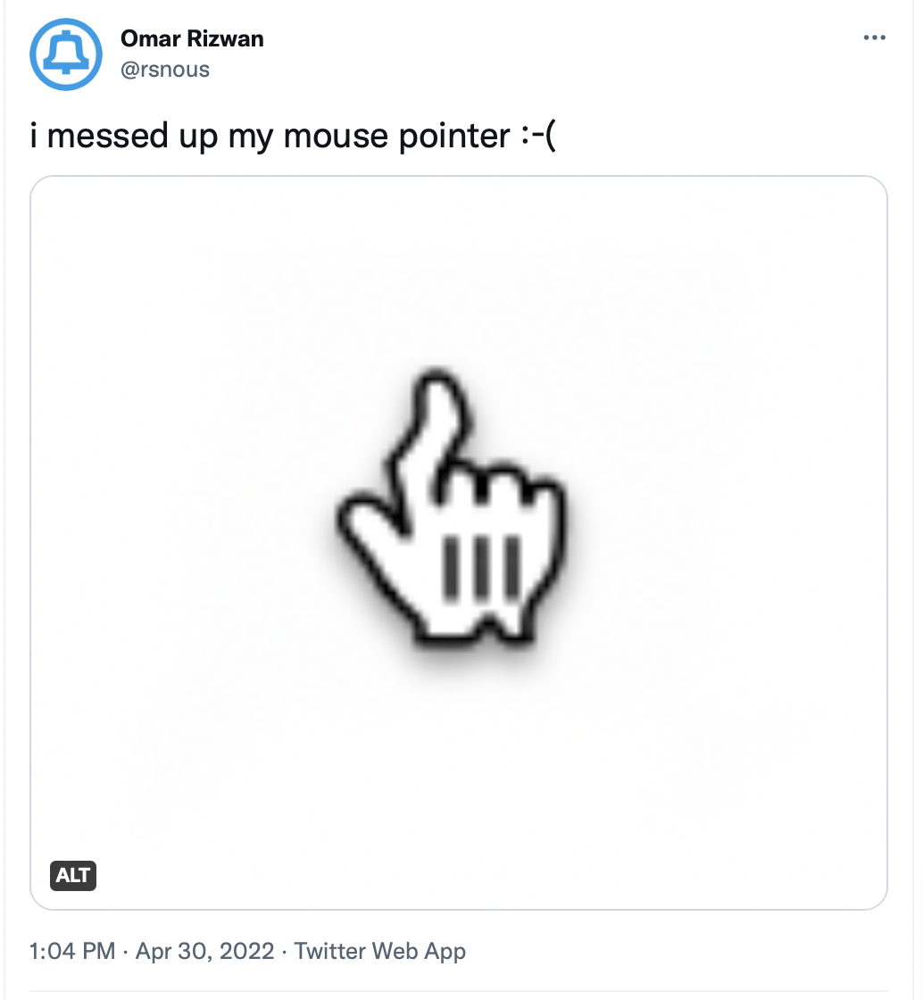

# weird-pointer

(this is a branch of an earlier revision of
[pretty-print](https://github.com/osnr/pretty-print), turned into a
separate repo for ease of browsing)

(i have a [thing](https://www.are.na/toph-tucker/the-computer-mouse)
with mouse pointer, i guess :-)

## how it works

it's not your real mouse pointer that's getting warped -- it's [an SVG
file](vendor/pointinghand.svg) that follows your mouse around while
your real pointer is hidden. the SVG path vertices are warped to
follow whatever letter is under them
